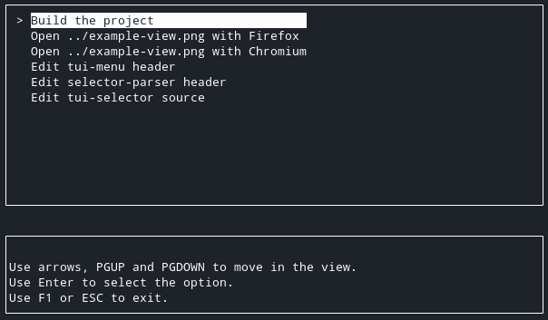

# TUI selector

Copyright (c) 2020-2021 [Antmicro](https://www.antmicro.com)

This is a simple TUI menu that looks for files described by regular expressions in JSON rules files and produces menu entries from which the commands specified for found files can be executed.

## Building the project

Project requires `ncurses` library and a C++ compiler with C++17 support.
In order to build it, run:

    mkdir build && cd build
    cmake ..
    make -j24

## Usage

The `tui-selector` requires path `rules_directory` to a directory with JSON files that describe creation of entries.

There can be multiple JSON files in the `rules_directory` directory.

The JSON files should look like:

    [
        {
            "searchdirectory" : "path/to/directory/with/files",
            "regex" : "<file-regex>",
            "command" : "<command-to-run>",
            "entryformat" : "<how-entry-should-be-displayed"
        },
        ...
    ]

Where:

* `searchdirectory` tells where are the files or executables to be used for the menu entries,
* `regex` holds the regular expression by which the files in `searchdirectory` should be filtered,
* `command` contains the command to be executed upon entry selection,
* `entryformat` describes how the entry for a given file and rule should be displayed in TUI menu.

Both `command` and `entryformat` are regex substitutions for `regex`.
This means that regex groups formed in `regex` can be accessed in `command` and `entryformat` by `$i`, where `i` is the ID of the group.

For example, for regex `"(^.*)\\/(.*)\\.pdf$"` and string `/directory/lab1-presentation.pdf` the `entryformat` with value `Open document $2 (okular)` will create entry `Open document lab1-presentation (okular)`.

## Example

Lets assume there are some images, videos, .txt or .pdf files in the Desktop directory.

Create a `rules/` directory, and a `multimedia.json` file with the following content (replace user with your user name):

    [
        {
            "searchdirectory" : "/home/user/Desktop",
            "regex" : "(^.*)\\/(.*\\.(mp4|avi))$",
            "command" : "vlc $1/$2",
            "entryformat" : "Video $2"
        },
        {
            "searchdirectory" : "/home/user/Desktop",
            "regex" : "(^.*)\\/(.*\\.(jpg|png))$",
            "command" : "gwenview $1/$2",
            "entryformat" : "Image $2"
        }
    ]
    
Then, add a `document.json` file:

    [
        {
            "searchdirectory" : "/home/user/Desktop",
            "regex" : "(^.*)\\/(.*)\\.pdf$",
            "command" : "okular $1/$2.pdf",
            "entryformat" : "Document $2"
        }
    ]

In the end, run:

    tui-selector ./rules/

The view should look something like this:

